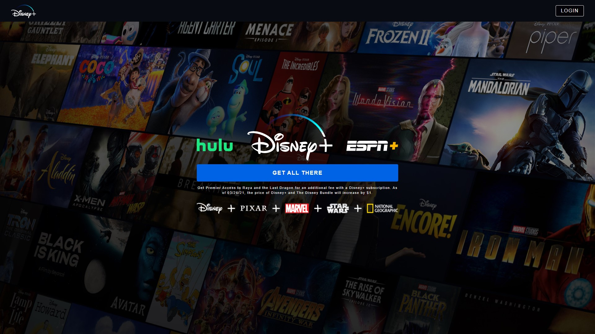
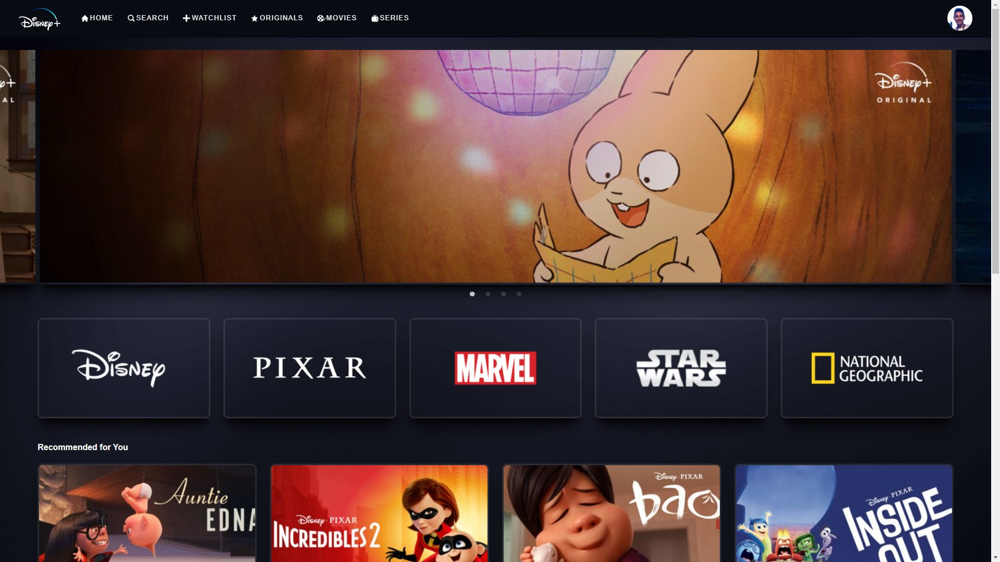
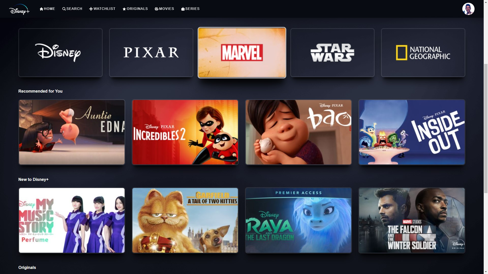
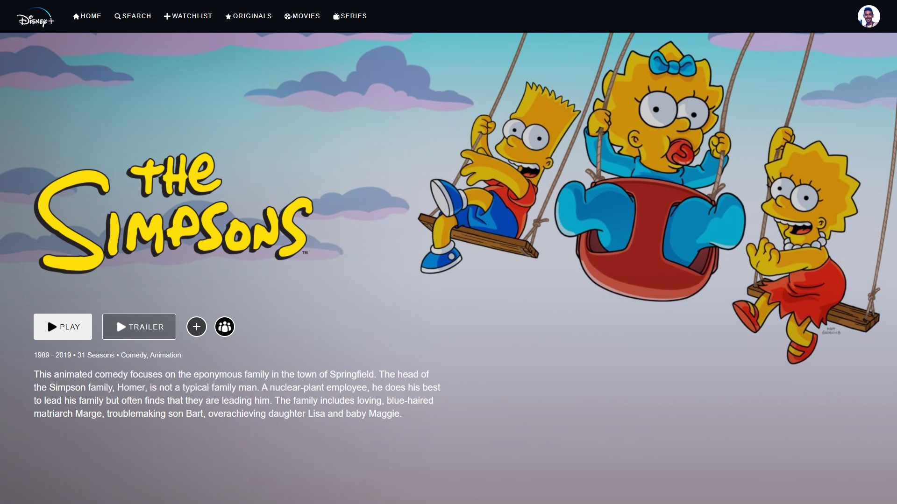

# Disney+ Clone w/ ReactJS

This is the ReactJS Disney Plus Clone from Clever Programmer class
This project was developed using ReactJS, Redux, Firebase and Styled Components

## App Description

In this project you can find:

### `Login Page`

This is the initial page of the application when you're not logged in

### `Home Page`

This is the main page of the application. Automatically redirected when logged in

### `Details Page`

This is the detail page of the selected movie or serie

